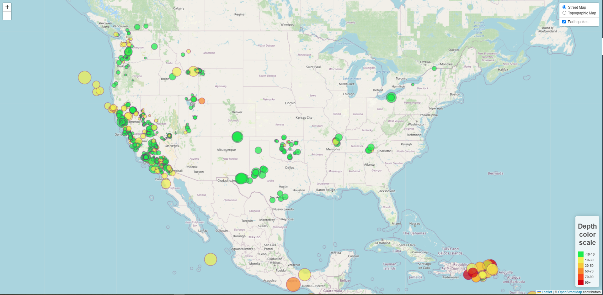
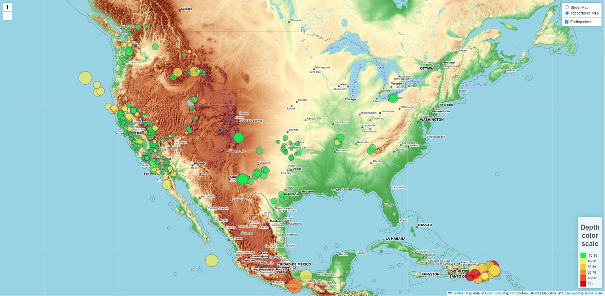

# Leaflet-challenge

Part 1: Create the Earthquake Visualization

This was an exercise to visualize the last 7 days earth quake data retrieved from https://earthquake.usgs.gov/earthquakes/feed/v1.0/summary/all_week.geojson
THe leaflet plug-in was used to create the map and place the geoJSON data on it. The outputs are listed below.

NOTE: 

I have worked on this challange myself. I did not seek help from anyone, or the Learning Assistant. 
However, I adopted the JavaScript code from Module 15 Class-1 activity 9 and 10. I also adopted the 
JavaScript and CSS code associated with legend creation from Class-2 activity 4.I made the necessary 
modifications to make the circle marker size and color reflect the magnitude and depth.

